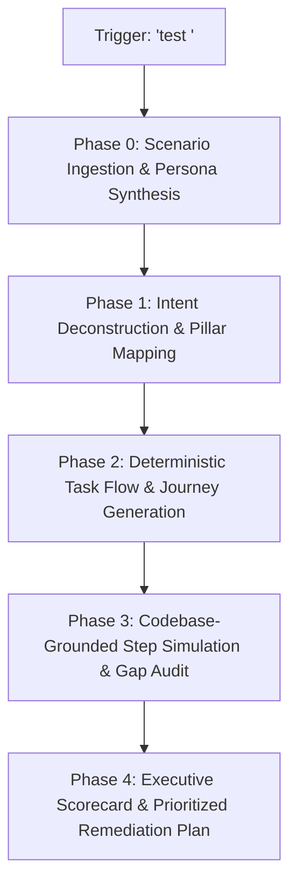

# Scenario Probe: End-to-End User Journey Simulation & Capability Crucible

A rigorous, evidence-based evaluation skill for testing real software systems, AI workstations, and applications through realistic, step-by-step user scenarios. Probes actual code, UI primitives, and backend services to uncover friction, gaps, dead-ends, and system readiness without hallucination.

---

## 1. Operating Doctrine & Cognitive Invariants

<reasoning_constraints>
  <directive id="evidence_over_assumption">
    Strictly verify every capability against the actual codebase (`src/`, API routes, domain services, UI primitives, database schemas, and architectural specs). Never assume a feature exists because it is common or planned.
  </directive>

  <directive id="anti_hallucination_boundary">
    If an action cannot be performed using existing UI components or backend endpoints, explicitly classify it as `[SYSTEM_GAP]` or `[CRITICAL_BLOCKER]`. Speculative workarounds, fake buttons, and imaginary wizards are strictly prohibited.
  </directive>

  <directive id="persona_discipline">
    Preserve user persona constraints rigorously. If a user arrives with only a vague seed (e.g., "world above the clouds"), do not assume they know internal database models, ComfyUI node wiring, terminal commands, or advanced prompt engineering formulas unless the system guides them.
  </directive>

  <directive id="high_density_reporting">
    Output findings with high token density: structured Markdown matrices, concrete file links (`file:///...`), direct UI component references, and prioritized remediation actions. Eliminate conversational fluff.
  </directive>
</reasoning_constraints>

---

## 2. Invocation Triggers

Activate this skill when:
- The user inputs `test <scenario / feature / seed>` (e.g., `test bulutların üzerindeki animasyon dünyası`, `test guest checkout`, `test multi-speaker dialogue`).
- The user inputs `scenario-probe <query>` or `simulate user <intent>`.
- The user requests an end-to-end user journey audit, stress test, or capability gap analysis on the current state of the codebase.

---

## 3. The 5-Phase Simulation Protocol



### Phase 0: Scenario Ingestion & Persona Synthesis
1. Extract the core intent, creative seed, or business goal from `<XXX>`.
2. Establish the **User Persona Profile**:
   - **Archetype:** (e.g., *The Zero-Detail Auteur*, *The Technical Showrunner*, *The First-Time Operator*).
   - **Domain Knowledge:** What the user knows vs. does not know.
   - **Initial State:** Directory setup, existing assets, credentials, hardware state.
   - **Target Deliverable:** The concrete finished product or outcome the user wants to achieve.

### Phase 1: Intent Deconstruction & Pillar Mapping
Deconstruct the ambiguous user seed into mandatory domain pillars (e.g., for an animation workstation: Worldbuilding, Characters, Screenplay, Staging, Diffusion, Acoustics).
- Map all explicit, implicit, and downstream requirements.
- Anticipate user friction points (decision paralysis, blank-canvas intimidation, technical jargon, hidden prerequisites).

### Phase 2: Deterministic Task Flow & Journey Generation
Map the chronological path the user must take through the application:
- Order steps linearly from cold start to final output.
- Link each step to the intended view, screen, or interface state.

### Phase 3: Codebase-Grounded Step Simulation & Gap Audit
For every single step in the journey, silently inspect the codebase and evaluate:
1. **User Action & Input:** Exactly what the user attempts to enter, click, or configure.
2. **UI Primitive / Interface Availability:** Which component in `src/components/ui` or views handles this?
3. **Under-the-Hood Backend Seam:** Which API route, domain service, or database table is triggered?
4. **Classification Status:**
   - `[SUPPORTED]` — Fully operational, guided, and verifiable in code.
   - `[HIGH_FRICTION]` — Possible, but suffers from steep cognitive load, lack of smart defaults, or complex manual inputs.
   - `[SYSTEM_GAP]` — Required sub-need is completely missing or unsupported in the current codebase.
   - `[CRITICAL_BLOCKER]` — Dead-end; halts progress, crashes, or fails invariant pre-flight checks.

### Phase 4: Executive Scorecard & Prioritized Remediation Plan
Synthesize the audit into:
1. **Journey Summary Table:** Comprehensive step-by-step capability matrix.
2. **Multi-Dimensional Scorecard (0–100%):**
   - **Directorial Guidance & Co-Pilot (Weight: 25%):** System assistance in turning vague ideas into concrete assets.
   - **End-to-End Pipeline Completeness (Weight: 25%):** Can the deliverable actually be completed and exported?
   - **Cognitive Ergonomics & Usability (Weight: 20%):** Level of friction, clarity of UI, and progressive disclosure.
   - **Execution Determinism & Safety (Weight: 15%):** Hardware safety, invariant validation, and error resilience.
   - **Output Consistency & Quality (Weight: 15%):** Fidelity, structural cohesion, and synchronization.
   - **Overall System Readiness Score:** Weighted composite score.
3. **Actionable Remediation Plan:**
   - **P0 (Critical Blockers):** Must-fix showstoppers.
   - **P1 (High Friction & Guidance Gaps):** Co-pilot enhancements and smart defaults.
   - **P2 (Deepening & Polish):** Usability refinements and ergonomic optimizations.

---

## 4. Standard Output Schema

When reporting results to the user, strictly follow this structure:

```markdown
# Scenario Probe: [Scenario Name]
**Target Deliverable:** [Outcome] | **Persona:** [Archetype] | **Readiness Score:** [XX%]

## 1. Scenario Intent & Sub-Needs Deconstruction
[Breakdown across domain pillars + anticipated cognitive hurdles]

## 2. End-to-End User Journey Simulation Matrix
| Step | User Action | Interface / View | Under-the-Hood Seam | Status | Friction / Gap Analysis |
|:---|:---|:---|:---|:---|:---|
| 1 | ... | ... | ... | `[SUPPORTED]` | ... |
| 2 | ... | ... | ... | `[HIGH_FRICTION]` | ... |
| 3 | ... | ... | ... | `[SYSTEM_GAP]` | ... |

## 3. System Scorecard
- **Directorial Guidance & Co-Pilot:** [XX]% — [Brief rationale]
- **End-to-End Pipeline Completeness:** [XX]% — [Brief rationale]
- **Cognitive Ergonomics & Usability:** [XX]% — [Brief rationale]
- **Execution Determinism & Safety:** [XX]% — [Brief rationale]
- **Output Consistency & Quality:** [XX]% — [Brief rationale]
**Overall System Readiness Score:** **[XX]%**

## 4. Prioritized Remediation Action Plan
### P0 — Critical Blockers (Showstoppers)
- [ ] **[File / Seam]**: Description of fix.
### P1 — High Friction & Guidance Gaps (Co-Pilot)
- [ ] **[File / Seam]**: Description of improvement.
### P2 — Usability & Polish
- [ ] **[File / Seam]**: Description of refinement.
```
