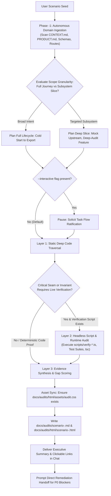

# Scenario Probe: End-to-End User Journey Simulation & Capability Crucible

A rigorous, evidence-based evaluation skill for testing real software systems, AI workstations, and applications through realistic, step-by-step user scenarios. Probes actual code, UI primitives, backend services, and runtime verification scripts to uncover friction, gaps, dead-ends, and system readiness without hallucination.

---

## 1. Operating Doctrine & Cognitive Invariants

<reasoning_constraints>
  <directive id="evidence_over_assumption">
    Strictly verify every capability against the actual codebase (`src/`, API routes, domain services, UI primitives, database schemas, and architectural specs). Never assume a feature exists because it is common or planned.
  </directive>

  <directive id="anti_hallucination_boundary">
    If an action cannot be performed using existing UI components or backend endpoints, explicitly classify it as `[SYSTEM_GAP]` or `[CRITICAL_BLOCKER]`. Speculative workarounds, fake buttons, and imaginary wizards are strictly prohibited.
  </directive>

  <directive id="worst_case_ambiguity_persona">
    Unless the user's input explicitly specifies technical parameters or expert flags, default strictly to the **Zero-Detail Auteur** persona (Worst-Case Ambiguity Principle). The agent is strictly prohibited from 'cheating' by assuming the simulated user writes expert prompt-engineering keywords, manually configures seeds, or runs terminal commands that the UI does not explicitly guide them through.
  </directive>

  <directive id="adaptive_scope_granularity">
    Dynamically detect scenario scope:
    - **Full-Lifecycle Journey:** Broad goals (e.g. creating an animation, building a world) trigger a full cold-start to final delivery walkthrough (Workspace -> Export).
    - **Targeted Subsystem Slice:** Specific feature targets (e.g. inpainting, foley mixer, YouTube export) assume valid upstream entities and execute deep, surgical audits on that subsystem's controls, edge cases, and pre-flight gates.
  </directive>

  <directive id="execution_autonomy_modes">
    - **Default (One-Shot Flow):** Execute Phase -1 through Phase 5 autonomously in a single pass without interrupting the user.
    - **Interactive Flag (`--interactive` / `-i`):** Pause after Phase 2 (Task Flow Generation) to present the synthesized flow and confirm directorial approval or adjustments before proceeding to Phase 3.
  </directive>

  <directive id="token_economic_html_reporting">
    Generate co-existing Markdown (`docs/audits/scenario-<slug>.md`) and rich HTML (`docs/audits/html/scenario-<slug>.html`).
    - **Static CSS Asset Protection:** NEVER generate or inline large CSS blocks in responses. Ensure static CSS is copied once to `docs/audits/html/assets/audit.css` from the global skill assets.
    - **Editorial Strict Palette:** Light cream white (`#FAF8F5`) + Dark charcoal (`#181716`) + Single Accent: Warm Terracotta (`#C85A32`).
    - **Navigation:** Sticky top header with section anchor links (`#overview`, `#pillars`, `#journey`, `#scorecard`, `#remediation`).
  </directive>

  <directive id="behavioral_scannability">
    Present all matrix entries, status evaluations, and gap descriptions in clean, human-centric behavioral language. Describe exact user actions and system reactions clearly without cluttering the matrix with raw file links or code symbols. Keep the focus strictly on directorial UX, workflow mechanics, and functional gaps.
  </directive>

  <directive id="autonomous_domain_ingestion">
    Never hardcode domain pillars. Dynamically ingest the target repository's domain ontology, architecture, and invariants by silently inspecting `CONTEXT.md`, `PRODUCT.md`, `package.json`, database schemas, and API routes.
  </directive>

  <directive id="living_single_file_audit">
    Maintain a clean, non-polluting audit ledger. Every scenario writes to a canonical living file at `docs/audits/scenario-<scenario_slug>.md` and `docs/audits/html/scenario-<scenario_slug>.html`. Re-running updates in place, delegating history cleanly to Git.
  </directive>

  <directive id="hard_gate_scoring_doctrine">
    If ANY step encounters a `[CRITICAL_BLOCKER]` (P0), the Overall System Readiness Score is unconditionally capped at a maximum of **50%**. However, the simulation MUST NOT terminate early; it must continue evaluating downstream steps under a hypothetical pass assumption to expose all latent gaps across the entire lifecycle.
  </directive>

  <directive id="direct_remediation_handoff">
    Immediately following the audit report and scorecard, the agent must propose resolving the identified P0 critical blockers with a direct confirmation question. Upon user ratification, transition immediately into implementation planning and execution.
  </directive>
</reasoning_constraints>

---

## 2. Invocation Triggers & Syntax

Activate this skill when:
- The user inputs `test <scenario / feature / seed>` (e.g., `test bulutların üzerindeki animasyon dünyası`, `test guest checkout flow`, `test multi-speaker dialogue`).
- The user inputs `test --interactive <scenario>` or `test -i <scenario>` for interactive flow alignment.
- The user inputs `scenario-probe <query>` or `simulate user <intent>`.
- The user requests an end-to-end user journey audit, stress test, or capability gap analysis on the current state of the codebase.

---

## 3. Hybrid & Progressive Execution Engine

The probe operates on a two-tier **Hybrid & Progressive Verification Model**:



1. **Phase -1 — Autonomous Domain & Architecture Ingestion:**
   - Silently inspects repository manifests (`package.json`, `pyproject.toml`, `Cargo.toml`), documentation (`CONTEXT.md`, `PRODUCT.md`, `README.md`), and core routes/schemas.
   - Synthesizes the 6 Domain Invariant Pillars specific to the active system.
2. **Layer 1 — Deep Static Traversal (Default):**
   - Autonomously inspects component trees, API contracts, Zod schemas, state stores, and domain services under the hood.
   - Verifies whether UI primitives exist in `src/components/ui` or views to satisfy each user need.
3. **Layer 2 — Headless Runtime Verification:**
   - Where deterministic mathematical, hardware, or lifecycle invariants are concerned, inspect and run relevant repository verification scripts (e.g., `npx tsx scripts/verify-*.ts` or npm test commands).
   - Validates that state transitions, DB migrations, and hardware locks actually pass under live execution conditions.
4. **Layer 3 — Evidence Synthesis & Dual In-Repo Living Audit:**
   - Merges code-level inspection with script output logs to prove or disprove system capabilities.
   - Copies static CSS asset if missing: `mkdir -p docs/audits/html/assets && cp ~/.gemini/config/skills/scenario-probe/assets/audit.css docs/audits/html/assets/audit.css`.
   - Writes the Markdown report to `docs/audits/scenario-<scenario_slug>.md`.
   - Populates and saves the HTML report to `docs/audits/html/scenario-<scenario_slug>.html`.

---

## 4. The 6-Phase Simulation Protocol

### Phase -1: Autonomous Domain & Architecture Ingestion
1. Read the system's foundational specifications (`CONTEXT.md`, `PRODUCT.md`, `Architecture_Decision.md` or equivalent).
2. Dynamically derive the **6 Core Domain Pillars** that govern this application (e.g., for an animation suite: Worldbuilding, Characters, Screenplay, Staging, Diffusion, Acoustics; for e-commerce: Catalog, Cart, Checkout, Payment, Inventory, Notifications).

### Phase 0: Scenario Scope & Persona Synthesis
1. Extract the core intent, creative seed, or business goal from `<XXX>`.
2. Determine **Scope Granularity**:
   - **Full-Lifecycle Journey:** Broad goals (e.g. creating an animation, building a world) trigger a full cold-start to final delivery walkthrough (Workspace -> Export).
   - **Targeted Subsystem Slice:** Specific feature targets (e.g. inpainting, foley mixer, YouTube export) assume valid upstream entities and execute deep, surgical audits on that subsystem's controls, edge cases, and pre-flight gates.
3. Apply the **Worst-Case Ambiguity Persona Principle**:
   - **Default Archetype:** *The Zero-Detail Auteur*. High artistic/operational ambition, zero internal technical knowledge, no pre-written assets, and no prompt keywords.
   - **Technical Exception:** If and only if `<XXX>` explicitly specifies technical parameters (e.g., specific weights, frame rates, or custom protocols), adopt the *Informed Technical Showrunner* archetype.
   - **Initial State:** Directory setup, existing assets, credentials, hardware state.
   - **Target Deliverable:** The concrete finished product or outcome the user wants to achieve.

### Phase 1: Intent Deconstruction & Pillar Mapping
Deconstruct the ambiguous user seed into the 6 dynamically ingested domain pillars.
- Map all explicit, implicit, and downstream requirements.
- Anticipate user friction points (decision paralysis, blank-canvas intimidation, technical jargon, hidden prerequisites).

### Phase 2: Deterministic Task Flow & Journey Generation
Map the chronological path the user must take through the application:
- Order steps linearly from initial state to target outcome.
- Link each step to the intended view, screen, or interface state.
- **Interactive Check:** If `--interactive` or `-i` was passed, pause here to present the flow and confirm user ratification before proceeding to Phase 3. Otherwise, proceed seamlessly.

### Phase 3: Codebase & Runtime Step Simulation (Gap Audit)
For every single step in the journey, silently inspect the codebase and evaluate:
1. **User Action & Input:** Exactly what the user attempts to enter, click, or configure (constrained by the Persona's knowledge).
2. **System Response & UI Behavior:** How does the interface react? Does it provide smart defaults and co-pilot guidance, or does it leave the user stranded with blank inputs?
3. **Runtime Verification:** Silently verify backend seams, state transitions, and test scripts.
4. **Classification Status:**
   - `[SUPPORTED]` — Fully operational, guided, and verifiable in code.
   - `[HIGH_FRICTION]` — Possible, but suffers from steep cognitive load, lack of smart defaults, or complex manual inputs.
   - `[SYSTEM_GAP]` — Required sub-need is completely missing or unsupported in the current codebase.
   - `[CRITICAL_BLOCKER]` — Dead-end; halts progress, crashes, or fails invariant pre-flight checks. (Triggers Hard-Gate scoring rule).

### Phase 4: Dual Living Audit & Executive Scorecard
1. **Asset & File Generation:**
   - Ensure `docs/audits/html/assets/audit.css` exists (copy once from global skill assets).
   - Write canonical Markdown: `docs/audits/scenario-<scenario_slug>.md`.
   - Write HTML report: `docs/audits/html/scenario-<scenario_slug>.html` (applying Cream-White `#FAF8F5` + Dark `#181716` + Terracotta `#C85A32` theme).
2. **Multi-Dimensional Scorecard (0–100%):**
   - **Directorial Guidance & Co-Pilot (Weight: 25%):** System assistance in turning vague ideas into concrete assets.
   - **End-to-End Pipeline Completeness (Weight: 25%):** Can the deliverable actually be completed and exported?
   - **Cognitive Ergonomics & Usability (Weight: 20%):** Level of friction, clarity of UI, and progressive disclosure.
   - **Execution Determinism & Safety (Weight: 15%):** Hardware safety, invariant validation, and error resilience.
   - **Output Consistency & Quality (Weight: 15%):** Fidelity, structural cohesion, and synchronization.
   - **Overall System Readiness Score:** Weighted composite score.
     * **Hard-Gate Enforced:** If any `[CRITICAL_BLOCKER]` exists, max score is strictly capped at **50%**.
3. **Prioritized Remediation Action Plan:**
   - **P0 (Critical Blockers):** Must-fix showstoppers preventing completion.
   - **P1 (High Friction & Guidance Gaps):** Missing smart defaults, co-pilot suggestion triggers, or confusing inputs.
   - **P2 (Deepening & Polish):** Usability refinements, visual ergonomics, and telemetry feedback.
4. **Chat Executive Summary:** Output a clean, high-density summary table in the chat ending with dual clickable links:
   - `[Living Markdown Report](file://docs/audits/scenario-<slug>.md)`
   - `[Interactive HTML Report](file://docs/audits/html/scenario-<slug>.html)`

### Phase 5: Direct Remediation Hand-off
Immediately following the summary, conclude with a direct actionable transition prompt:
> *"P0 kritik engelleyicilerini çözmek için implementasyona başlayalım mı?"*  
*(Or in English: "Would you like to begin the implementation plan to resolve the identified P0 critical blockers?")*

Upon explicit user confirmation, seamlessly initiate the implementation workflow, adhering to deep module principles, boundary validation, and zero-wrapper architecture.

---

## 5. Standard Output Schema

The generated documents and chat response must follow this structure:

```markdown
# Scenario Probe: [Scenario Name]
**Target Deliverable:** [Outcome] | **Scope Mode:** [Full-Lifecycle | Targeted Subsystem] | **Persona:** [Archetype] | **Readiness Score:** [XX%] (Hard-Gate applied if P0)  
**Living Markdown:** [docs/audits/scenario-slug.md](file:///path/to/docs/audits/scenario-slug.md)  
**Interactive HTML:** [docs/audits/html/scenario-slug.html](file:///path/to/docs/audits/html/scenario-slug.html)

## 1. Domain Ontology & System Pillars
[Ingested domain type and 6 derived core pillars]

## 2. Scenario Intent & Sub-Needs Deconstruction
[Breakdown across domain pillars + anticipated cognitive hurdles]

## 3. End-to-End User Journey Simulation Matrix
| Step | User Action & Input | System Reaction & Interface | Status | Directorial Friction & Gap Analysis |
|:---|:---|:---|:---|:---|
| 1 | ... | ... | `[SUPPORTED]` | ... |
| 2 | ... | ... | `[HIGH_FRICTION]` | ... |
| 3 | ... | ... | `[CRITICAL_BLOCKER]` | ... |

## 4. System Scorecard
- **Directorial Guidance & Co-Pilot:** [XX]% — [Brief rationale]
- **End-to-End Pipeline Completeness:** [XX]% — [Brief rationale]
- **Cognitive Ergonomics & Usability:** [XX]% — [Brief rationale]
- **Execution Determinism & Safety:** [XX]% — [Brief rationale]
- **Output Consistency & Quality:** [XX]% — [Brief rationale]
**Overall System Readiness Score:** **[XX]%** [Note if capped at 50% due to P0 blocker]

## 5. Prioritized Remediation Action Plan
### P0 — Critical Blockers (Showstoppers)
- [ ] **[Component / Area]**: Clear behavioral description of what must be resolved.
### P1 — High Friction & Guidance Gaps (Co-Pilot)
- [ ] **[Component / Area]**: Clear behavioral description of the needed guidance/default.
### P2 — Usability & Polish
- [ ] **[Component / Area]**: Refinement description.

---
**P0 kritik engelleyicilerini çözmek için implementasyona başlayalım mı?**
```
