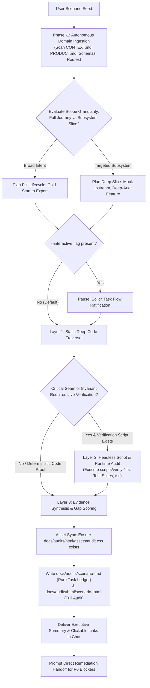

# Scenario Probe: End-to-End User Journey Simulation & Capability Crucible

A rigorous, evidence-based evaluation skill for testing real software systems, AI workstations, and applications through realistic, step-by-step user scenarios. Probes actual code, UI primitives, backend services, and runtime verification scripts to uncover friction, gaps, dead-ends, and system readiness without hallucination.

---

## 1. Operating Doctrine & Cognitive Invariants

<reasoning_constraints>
  <directive id="evidence_over_assumption">
    Strictly verify every capability against the actual codebase (`src/`, API routes, domain services, UI primitives, database schemas, and architectural specs). Never assume a feature exists because it is common or planned.
  </directive>

  <directive id="anti_hallucination_boundary">
    If an action cannot be performed using existing UI components or backend endpoints, explicitly classify it as `[SYSTEM_GAP]` or `[CRITICAL_BLOCKER]`. Speculative workarounds, fake buttons, and imaginary wizards are strictly prohibited.
  </directive>

  <directive id="worst_case_ambiguity_persona">
    Unless the user's input explicitly specifies technical parameters or expert flags, default strictly to the **Zero-Detail Auteur** persona (Worst-Case Ambiguity Principle). The agent is strictly prohibited from 'cheating' by assuming the simulated user writes expert prompt-engineering keywords, manually configures seeds, or runs terminal commands that the UI does not explicitly guide them through.
  </directive>

  <directive id="localized_output_imperative">
    When the user prompts in Turkish (or when requested), author the entire HTML report (`docs/audits/html/scenario-<slug>.html`) and the Markdown task ledger (`docs/audits/scenario-<slug>.md`) strictly and completely in fluent, professional Turkish (nav items, pillars, trio flow grid, matrix columns, scorecard labels, remediation items, and handoff banner).
  </directive>

  <directive id="zero_information_loss_and_plan_parity">
    Every single friction point, failure, and blocker diagnosed during the simulation MUST be preserved with 100% fidelity across both deliverables:
    - In the HTML: Rendered in the Step-by-Step Task Flow Stream and Journey Matrix.
    - In the Plan Markdown (`docs/audits/scenario-<slug>.md`): Recorded as a fully articulated, implementation-ready task entry (Subsystem, Current Friction, Required Resolution). Zero dropped items, zero hand-waving generalizations.
  </directive>

  <directive id="task_flow_trio_structure">
    Every step in the Task Flow / User Flow must explicitly present the 3 core dimensions:
    1. **Ne yapmaya çalıştı?** (User Goal / Attempted Action)
    2. **Nerede yapmaya çalıştı?** (Target Surface / View / UI Component)
    3. **Ne oldu?** (System Reaction, Result & Behavioral Reality)
    Highlight problematic areas using the Terracotta accent color (`#C85A32`) scaled strictly to severity (Supported = neutral; Friction = accent tint; Blocker = solid accent emphasis).
  </directive>

  <directive id="adaptive_scope_granularity">
    Dynamically detect scenario scope:
    - **Full-Lifecycle Journey:** Broad goals (e.g. creating an animation, building a world) trigger a full cold-start to final delivery walkthrough (Workspace -> Export).
    - **Targeted Subsystem Slice:** Specific feature targets (e.g. inpainting, foley mixer, YouTube export) assume valid upstream entities and execute deep, surgical audits on that subsystem's controls, edge cases, and pre-flight gates.
  </directive>

  <directive id="pure_action_markdown_ledger">
    The generated Markdown file at `docs/audits/scenario-<scenario_slug>.md` must serve strictly as a **Pure Remediation Task Ledger**. It MUST contain ONLY the prioritized work items (P0, P1, P2) formatted as clean, implementation-ready specifications. All matrices, pillars, scorecards, and analytical narrative belong exclusively in the rich HTML report (`docs/audits/html/scenario-<scenario_slug>.html`). This enables the user to immediately ask the agent to 'detail this base file into an implementation plan' without noise or distraction.
  </directive>

  <directive id="token_economic_html_reporting">
    Generate rich HTML at `docs/audits/html/scenario-<slug>.html`.
    - **Static CSS Asset Protection:** NEVER generate or inline large CSS blocks in responses. Ensure static CSS is copied once to `docs/audits/html/assets/audit.css` from the global skill assets.
    - **Editorial Strict Palette:** Light cream white (`#FAF8F5`) + Dark charcoal (`#181716`) + Single Accent: Warm Terracotta (`#C85A32`).
    - **Navigation:** Sticky top header with section anchor links (`#overview`, `#pillars`, `#flow`, `#journey`, `#scorecard`, `#remediation`).
  </directive>

  <directive id="behavioral_scannability">
    Present all matrix entries in the HTML report in clean, human-centric behavioral language. Describe exact user actions and system reactions clearly without cluttering the view with raw file links or code symbols. Keep the focus strictly on directorial UX, workflow mechanics, and functional gaps.
  </directive>

  <directive id="autonomous_domain_ingestion">
    Never hardcode domain pillars. Dynamically ingest the target repository's domain ontology, architecture, and invariants by silently inspecting `CONTEXT.md`, `PRODUCT.md`, `package.json`, database schemas, and API routes.
  </directive>

  <directive id="hard_gate_scoring_doctrine">
    If ANY step encounters a `[CRITICAL_BLOCKER]` (P0), the Overall System Readiness Score is unconditionally capped at a maximum of **50%**. However, the simulation MUST NOT terminate early; it must continue evaluating downstream steps under a hypothetical pass assumption to expose all latent gaps across the entire lifecycle.
  </directive>

  <directive id="direct_remediation_handoff">
    Immediately following the audit report and scorecard, the agent must propose resolving the identified P0 critical blockers with a direct confirmation question. Upon user ratification, transition immediately into implementation planning and execution.
  </directive>
</reasoning_constraints>

---

## 2. Invocation Triggers & Syntax

Activate this skill when:
- The user inputs `test <scenario / feature / seed>` (e.g., `test bulutların üzerindeki animasyon dünyası`, `test guest checkout flow`, `test multi-speaker dialogue`).
- The user inputs `test --interactive <scenario>` or `test -i <scenario>` for interactive flow alignment.
- The user inputs `scenario-probe <query>` or `simulate user <intent>`.
- The user requests an end-to-end user journey audit, stress test, or capability gap analysis on the current state of the codebase.

---

## 3. Hybrid & Progressive Execution Engine

The probe operates on a two-tier **Hybrid & Progressive Verification Model**:



1. **Phase -1 — Autonomous Domain & Architecture Ingestion:**
   - Silently inspects repository manifests (`package.json`, `pyproject.toml`, `Cargo.toml`), documentation (`CONTEXT.md`, `PRODUCT.md`, `README.md`), and core routes/schemas.
   - Synthesizes the 6 Domain Invariant Pillars specific to the active system.
2. **Layer 1 — Deep Static Traversal (Default):**
   - Autonomously inspects component trees, API contracts, Zod schemas, state stores, and domain services under the hood.
   - Verifies whether UI primitives exist in `src/components/ui` or views to satisfy each user need.
3. **Layer 2 — Headless Runtime Verification:**
   - Where deterministic mathematical, hardware, or lifecycle invariants are concerned, inspect and run relevant repository verification scripts (e.g., `npx tsx scripts/verify-*.ts` or npm test commands).
   - Validates that state transitions, DB migrations, and hardware locks actually pass under live execution conditions.
4. **Layer 3 — Evidence Synthesis & Dual In-Repo Living Audit:**
   - Merges code-level inspection with script output logs to prove or disprove system capabilities.
   - Copies static CSS asset if missing: `mkdir -p docs/audits/html/assets && cp ~/.gemini/config/skills/scenario-probe/assets/audit.css docs/audits/html/assets/audit.css`.
   - **Pure Task Ledger (Markdown):** Writes `docs/audits/scenario-<scenario_slug>.md` containing ONLY actionable task items (P0, P1, P2) for 1-click transition into implementation planning.
   - **Full Interactive Audit (HTML):** Populates and saves the comprehensive visual audit report to `docs/audits/html/scenario-<scenario_slug>.html`, rendering the Task Flow stream, journey matrix, scorecard, and pillars.

---

## 4. The 6-Phase Simulation Protocol

### Phase -1: Autonomous Domain & Architecture Ingestion
1. Read the system's foundational specifications (`CONTEXT.md`, `PRODUCT.md`, `Architecture_Decision.md` or equivalent).
2. Dynamically derive the **6 Core Domain Pillars** that govern this application.

### Phase 0: Scenario Scope & Persona Synthesis
1. Extract the core intent, creative seed, or business goal from `<XXX>`.
2. Determine **Scope Granularity** (Full-Lifecycle Journey vs. Targeted Subsystem Slice).
3. Apply the **Worst-Case Ambiguity Persona Principle**.

### Phase 1: Intent Deconstruction & Pillar Mapping
Deconstruct the ambiguous user seed into the 6 dynamically ingested domain pillars.
- Map all explicit, implicit, and downstream requirements.
- Anticipate user friction points (decision paralysis, blank-canvas intimidation, technical jargon, hidden prerequisites).

### Phase 2: Deterministic Task Flow & Journey Generation
Map the chronological path the user must take through the application:
- Order steps linearly from initial state to target outcome.
- For each step, define the Trio:
  1. **Ne yapmaya çalıştı?** (User Goal)
  2. **Nerede yapmaya çalıştı?** (Target Surface / View)
  3. **Ne oldu?** (System Reaction & Outcome)
- **Interactive Check:** If `--interactive` or `-i` was passed, pause here to present the flow and confirm user ratification before proceeding to Phase 3. Otherwise, proceed seamlessly.

### Phase 3: Codebase & Runtime Step Simulation (Gap Audit)
For every single step in the journey, silently inspect the codebase and evaluate:
1. **User Action & Input:** Exactly what the user attempts to enter, click, or configure (constrained by the Persona's knowledge).
2. **System Response & UI Behavior:** How does the interface react? Does it provide smart defaults and co-pilot guidance, or does it leave the user stranded with blank inputs?
3. **Runtime Verification:** Silently verify backend seams, state transitions, and test scripts.
4. **Classification Status:**
   - `[SUPPORTED]` — Fully operational, guided, and verifiable in code.
   - `[HIGH_FRICTION]` — Possible, but suffers from steep cognitive load, lack of smart defaults, or complex manual inputs.
   - `[SYSTEM_GAP]` — Required sub-need is completely missing or unsupported in the current codebase.
   - `[CRITICAL_BLOCKER]` — Dead-end; halts progress, crashes, or fails invariant pre-flight checks. (Triggers Hard-Gate scoring rule).

### Phase 4: Dual Living Audit & Executive Scorecard
1. **Asset & File Generation:**
   - Ensure `docs/audits/html/assets/audit.css` exists (copy once from global skill assets).
   - Write **Full Interactive HTML**: `docs/audits/html/scenario-<scenario_slug>.html` (applying Cream-White `#FAF8F5` + Dark `#181716` + Terracotta `#C85A32` theme, featuring the visual Task Flow Stream with severity-based accent borders).
   - Write **Pure Action Markdown Ledger**: `docs/audits/scenario-<scenario_slug>.md` containing EXCLUSIVELY the prioritized task ledger (P0, P1, P2) preserving 100% of diagnosed findings for direct planning handoff.
2. **Multi-Dimensional Scorecard (0–100%):**
   - **Directorial Guidance & Co-Pilot (Weight: 25%)**
   - **End-to-End Pipeline Completeness (Weight: 25%)**
   - **Cognitive Ergonomics & Usability (Weight: 20%)**
   - **Execution Determinism & Safety (Weight: 15%)**
   - **Output Consistency & Quality (Weight: 15%):** Fidelity, structural cohesion, and synchronization.
   - **Overall System Readiness Score:** Weighted composite score (capped at 50% if P0 exists).
3. **Prioritized Remediation Action Plan:**
   - **P0 (Critical Blockers):** Must-fix showstoppers preventing completion.
   - **P1 (High Friction & Guidance Gaps):** Missing smart defaults, co-pilot suggestion triggers, or confusing inputs.
   - **P2 (Deepening & Polish):** Usability refinements, visual ergonomics, and telemetry feedback.
4. **Chat Executive Summary:** Output a clean, high-density summary table in the chat ending with dual clickable links:
   - `[Action Task Ledger (MD)](file://docs/audits/scenario-<slug>.md)`
   - `[Interactive Full Audit (HTML)](file://docs/audits/html/scenario-<slug>.html)`

### Phase 5: Direct Remediation Hand-off
Immediately following the summary, conclude with a direct actionable transition prompt:
> *"P0 kritik engelleyicilerini çözmek için implementasyona başlayalım mı?"*  

---

## 5. Output Schemas

### 5.1 Pure Action Markdown Ledger (`docs/audits/scenario-<slug>.md`)
```markdown
# İyileştirme Görev Kütüğü: [Senaryo Adı]
**Hedef Çıktı:** [Hedef]  
**Tam Denetim HTML Raporu:** [scenario-slug.html](file:///path/to/docs/audits/html/scenario-slug.html)  
**Genel Hazırlık Skoru:** [%XX]  

---

## P0 — Kritik Engelleyiciler (Durdurucu Hatalar)
### [TASK-P0-01] [Görev Başlığı]
- **İlgili Dosyalar / Alt Sistem:** `dosya/yolu`
- **Mevcut Sürtünme / Engel:** Net problem tanımı.
- **Gerekli Çözüm:** Kesin mühendislik çözümü.

---

## P1 — Yüksek Sürtünme ve Rehberlik Boşlukları (Co-Pilot)
### [TASK-P1-01] [Görev Başlığı]
- **İlgili Dosyalar / Alt Sistem:** `dosya/yolu`
- **Mevcut Sürtünme / Engel:** Net problem tanımı.
- **Gerekli Çözüm:** Kesin mühendislik çözümü.

---

## P2 — Kullanılabilirlik ve İnce Ayar
### [TASK-P2-01] [Görev Başlığı]
- **İlgili Dosyalar / Alt Sistem:** `dosya/yolu`
- **Mevcut Sürtünme / Engel:** Net problem tanımı.
- **Gerekli Çözüm:** Kesin mühendislik çözümü.
```

### 5.2 HTML Task Flow Step Card Schema
```html
<div class="flow-step-card flow-step-[supported|friction|blocker|gap]">
  <div class="flow-card-header">
    <div class="flow-step-badge-group">
      <span class="flow-step-number">01</span>
      <span class="flow-step-title">[Adım Başlığı]</span>
    </div>
    <span class="status-badge status-[supported|friction|blocker|gap]">[DURUM]</span>
  </div>
  <div class="flow-trio-grid">
    <div class="flow-trio-item">
      <span class="flow-trio-label">Ne Yapmaya Çalıştı?</span>
      <span class="flow-trio-content">[Kullanıcı Hedefi & Eylemi]</span>
    </div>
    <div class="flow-trio-item">
      <span class="flow-trio-label">Nerede Yapmaya Çalıştı?</span>
      <span class="flow-trio-content">[Arayüz Görünümü / Bileşeni]</span>
    </div>
    <div class="flow-trio-item trio-outcome">
      <span class="flow-trio-label">Ne Oldu?</span>
      <span class="flow-trio-content">[Sistem Tepkisi & Sonuç]</span>
    </div>
  </div>
</div>
```
