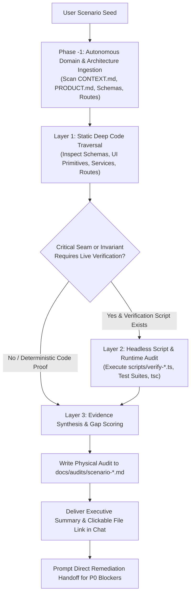

# Scenario Probe: End-to-End User Journey Simulation & Capability Crucible

A rigorous, evidence-based evaluation skill for testing real software systems, AI workstations, and applications through realistic, step-by-step user scenarios. Probes actual code, UI primitives, backend services, and runtime verification scripts to uncover friction, gaps, dead-ends, and system readiness without hallucination.

---

## 1. Operating Doctrine & Cognitive Invariants

<reasoning_constraints>
  <directive id="evidence_over_assumption">
    Strictly verify every capability against the actual codebase (`src/`, API routes, domain services, UI primitives, database schemas, and architectural specs). Never assume a feature exists because it is common or planned.
  </directive>

  <directive id="anti_hallucination_boundary">
    If an action cannot be performed using existing UI components or backend endpoints, explicitly classify it as `[SYSTEM_GAP]` or `[CRITICAL_BLOCKER]`. Speculative workarounds, fake buttons, and imaginary wizards are strictly prohibited.
  </directive>

  <directive id="worst_case_ambiguity_persona">
    Unless the user's input explicitly specifies technical parameters or expert flags, default strictly to the **Zero-Detail Auteur** persona (Worst-Case Ambiguity Principle). The agent is strictly prohibited from 'cheating' by assuming the simulated user writes expert prompt-engineering keywords, manually configures seeds, or runs terminal commands that the UI does not explicitly guide them through.
  </directive>

  <directive id="autonomous_domain_ingestion">
    Never hardcode domain pillars. Dynamically ingest the target repository's domain ontology, architecture, and invariants by silently inspecting `CONTEXT.md`, `PRODUCT.md`, `package.json`, database schemas, and API routes.
  </directive>

  <directive id="hard_gate_scoring_doctrine">
    If ANY step encounters a `[CRITICAL_BLOCKER]` (P0), the Overall System Readiness Score is unconditionally capped at a maximum of **50%**. However, the simulation MUST NOT terminate early; it must continue evaluating downstream steps under a hypothetical pass assumption to expose all latent gaps across the entire lifecycle.
  </directive>

  <directive id="in_repo_persistent_audit">
    Every scenario simulation must automatically generate a physical audit document in the repository at `docs/audits/scenario-<scenario_slug>-<YYYYMMDD-HHmmss>.md`. The chat response must provide a concise executive summary and link directly to this physical file.
  </directive>

  <directive id="direct_remediation_handoff">
    Immediately following the audit report and scorecard, the agent must propose resolving the identified P0 critical blockers with a direct confirmation question. Upon user ratification, transition immediately into implementation planning and execution.
  </directive>

  <directive id="high_density_reporting">
    Output findings with high token density: structured Markdown matrices, concrete file links (`file:///...`), direct UI component references, and prioritized remediation actions. Eliminate conversational fluff.
  </directive>
</reasoning_constraints>

---

## 2. Invocation Triggers & Syntax

Activate this skill when:
- The user inputs `test <scenario / feature / seed>` (e.g., `test bulutların üzerindeki animasyon dünyası`, `test guest checkout flow`, `test multi-speaker dialogue`).
- The user inputs `scenario-probe <query>` or `simulate user <intent>`.
- The user requests an end-to-end user journey audit, stress test, or capability gap analysis on the current state of the codebase.

---

## 3. Hybrid & Progressive Execution Engine

The probe operates on a two-tier **Hybrid & Progressive Verification Model**:



1. **Phase -1 — Autonomous Domain & Architecture Ingestion:**
   - Silently inspects repository manifests (`package.json`, `pyproject.toml`, `Cargo.toml`), documentation (`CONTEXT.md`, `PRODUCT.md`, `README.md`), and core routes/schemas.
   - Synthesizes the 6 Domain Invariant Pillars specific to the active system.
2. **Layer 1 — Deep Static Traversal (Default):**
   - Autonomously inspects component trees, API contracts, Zod schemas, state stores, and domain services.
   - Verifies whether UI primitives exist in `src/components/ui` or views to satisfy each user need.
3. **Layer 2 — Headless Runtime Verification:**
   - Where deterministic mathematical, hardware, or lifecycle invariants are concerned, inspect and run relevant repository verification scripts (e.g., `npx tsx scripts/verify-*.ts` or npm test commands).
   - Validates that state transitions, DB migrations, and hardware locks actually pass under live execution conditions.
4. **Layer 3 — Evidence Synthesis & In-Repo Persistence:**
   - Merges code-level inspection with script output logs to prove or disprove system capabilities.
   - Writes the full audit report into `docs/audits/scenario-<scenario_slug>-<YYYYMMDD-HHmmss>.md`.

---

## 4. The 6-Phase Simulation Protocol

### Phase -1: Autonomous Domain & Architecture Ingestion
1. Read the system's foundational specifications (`CONTEXT.md`, `PRODUCT.md`, `Architecture_Decision.md` or equivalent).
2. Dynamically derive the **6 Core Domain Pillars** that govern this application (e.g., for an animation suite: Worldbuilding, Characters, Screenplay, Staging, Diffusion, Acoustics; for e-commerce: Catalog, Cart, Checkout, Payment, Inventory, Notifications).

### Phase 0: Scenario Ingestion & Persona Synthesis
1. Extract the core intent, creative seed, or business goal from `<XXX>`.
2. Apply the **Worst-Case Ambiguity Persona Principle**:
   - **Default Archetype:** *The Zero-Detail Auteur*. High artistic/operational ambition, zero internal technical knowledge, no pre-written assets, and no prompt keywords.
   - **Technical Exception:** If and only if `<XXX>` explicitly specifies technical parameters (e.g., specific weights, frame rates, or custom protocols), adopt the *Informed Technical Showrunner* archetype.
   - **Initial State:** Directory setup, existing assets, credentials, hardware state.
   - **Target Deliverable:** The concrete finished product or outcome the user wants to achieve.

### Phase 1: Intent Deconstruction & Pillar Mapping
Deconstruct the ambiguous user seed into the 6 dynamically ingested domain pillars.
- Map all explicit, implicit, and downstream requirements.
- Anticipate user friction points (decision paralysis, blank-canvas intimidation, technical jargon, hidden prerequisites).

### Phase 2: Deterministic Task Flow & Journey Generation
Map the chronological path the user must take through the application:
- Order steps linearly from cold start to final output.
- Link each step to the intended view, screen, or interface state.

### Phase 3: Codebase & Runtime Step Simulation (Gap Audit)
For every single step in the journey, silently inspect the codebase and evaluate:
1. **User Action & Input:** Exactly what the user attempts to enter, click, or configure (constrained by the Persona's knowledge).
2. **UI Primitive / Interface Availability:** Which component in `src/components/ui` or views handles this? Does it provide smart defaults or co-pilot guidance, or does it present an empty, intimidating input?
3. **Under-the-Hood Backend Seam:** Which API route, domain service, or database table is triggered?
4. **Runtime Verification:** If an automated test/verification script exists for this seam, execute it or verify its latest assertions.
5. **Classification Status:**
   - `[SUPPORTED]` — Fully operational, guided, and verifiable in code.
   - `[HIGH_FRICTION]` — Possible, but suffers from steep cognitive load, lack of smart defaults, or complex manual inputs.
   - `[SYSTEM_GAP]` — Required sub-need is completely missing or unsupported in the current codebase.
   - `[CRITICAL_BLOCKER]` — Dead-end; halts progress, crashes, or fails invariant pre-flight checks. (Triggers Hard-Gate scoring rule).

### Phase 4: In-Repo Documentation & Executive Scorecard
1. **Physical File Generation:** Create the target folder if missing (`mkdir -p docs/audits`) and write the comprehensive report to `docs/audits/scenario-<scenario_slug>-<YYYYMMDD-HHmmss>.md`.
2. **Multi-Dimensional Scorecard (0–100%):**
   - **Directorial Guidance & Co-Pilot (Weight: 25%):** System assistance in turning vague ideas into concrete assets.
   - **End-to-End Pipeline Completeness (Weight: 25%):** Can the deliverable actually be completed and exported?
   - **Cognitive Ergonomics & Usability (Weight: 20%):** Level of friction, clarity of UI, and progressive disclosure.
   - **Execution Determinism & Safety (Weight: 15%):** Hardware safety, invariant validation, and error resilience.
   - **Output Consistency & Quality (Weight: 15%):** Fidelity, structural cohesion, and synchronization.
   - **Overall System Readiness Score:** Weighted composite score.
     * **Hard-Gate Enforced:** If any `[CRITICAL_BLOCKER]` exists, max score is strictly capped at **50%**.
3. **Prioritized Remediation Action Plan:**
   - **P0 (Critical Blockers):** Must-fix showstoppers preventing completion.
   - **P1 (High Friction & Guidance Gaps):** Missing smart defaults, co-pilot suggestion triggers, or confusing inputs.
   - **P2 (Deepening & Polish):** Usability refinements, visual ergonomics, and telemetry feedback.
4. **Chat Executive Summary:** Output a clean, high-density summary table in the chat ending with a direct markdown link to the physical file: `[Full Audit Report](file://docs/audits/...)`.

### Phase 5: Direct Remediation Hand-off
Immediately following the summary, conclude with a direct actionable transition prompt:
> *"P0 kritik engelleyicilerini çözmek için implementasyona başlayalım mı?"*  
*(Or in English: "Would you like to begin the implementation plan to resolve the identified P0 critical blockers?")*

Upon explicit user confirmation, seamlessly initiate the implementation workflow, adhering to deep module principles, boundary validation, and zero-wrapper architecture.

---

## 5. Standard Output Schema

The generated document in `docs/audits/scenario-<slug>-<timestamp>.md` and the chat response must follow this structure:

```markdown
# Scenario Probe: [Scenario Name]
**Target Deliverable:** [Outcome] | **Persona:** [Archetype] | **Readiness Score:** [XX%] (Hard-Gate applied if P0)  
**Physical Audit File:** [docs/audits/scenario-slug-timestamp.md](file:///path/to/docs/audits/scenario-slug-timestamp.md)

## 1. Domain Ontology & System Pillars
[Ingested domain type and 6 derived core pillars]

## 2. Scenario Intent & Sub-Needs Deconstruction
[Breakdown across domain pillars + anticipated cognitive hurdles]

## 3. End-to-End User Journey Simulation Matrix
| Step | User Action | Interface / View | Under-the-Hood Seam | Status | Friction / Gap Analysis |
|:---|:---|:---|:---|:---|:---|
| 1 | ... | ... | ... | `[SUPPORTED]` | ... |
| 2 | ... | ... | ... | `[HIGH_FRICTION]` | ... |
| 3 | ... | ... | ... | `[CRITICAL_BLOCKER]` | ... |

## 4. System Scorecard
- **Directorial Guidance & Co-Pilot:** [XX]% — [Brief rationale]
- **End-to-End Pipeline Completeness:** [XX]% — [Brief rationale]
- **Cognitive Ergonomics & Usability:** [XX]% — [Brief rationale]
- **Execution Determinism & Safety:** [XX]% — [Brief rationale]
- **Output Consistency & Quality:** [XX]% — [Brief rationale]
**Overall System Readiness Score:** **[XX]%** [Note if capped at 50% due to P0 blocker]

## 5. Prioritized Remediation Action Plan
### P0 — Critical Blockers (Showstoppers)
- [ ] **[File / Seam]**: Description of fix.
### P1 — High Friction & Guidance Gaps (Co-Pilot)
- [ ] **[File / Seam]**: Description of improvement.
### P2 — Usability & Polish
- [ ] **[File / Seam]**: Description of refinement.

---
**P0 kritik engelleyicilerini çözmek için implementasyona başlayalım mı?**
```
